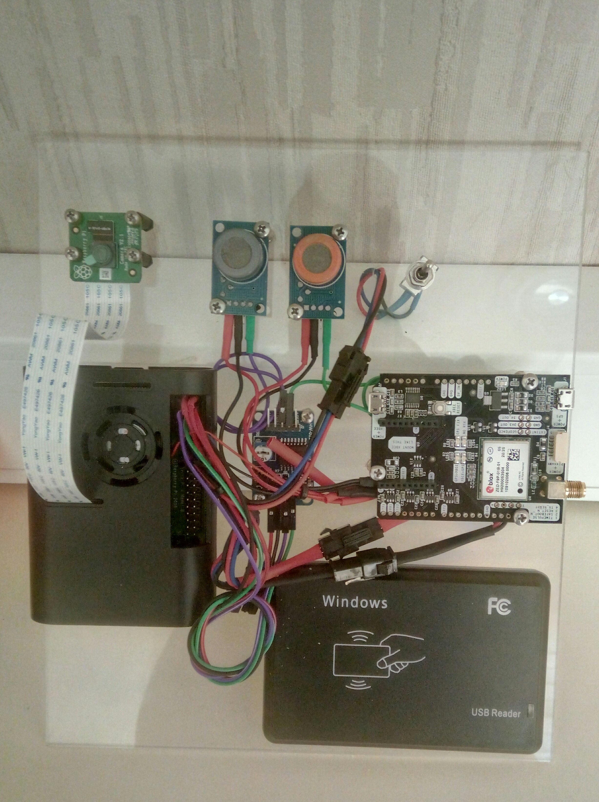

# Kamyon Takip Sistemi

  
 Donanım Genel Görünüm 

  
 RAM Yapısı 

  
 Proje Ekranı 

Python ile yazılmıştır.
Memory Map kütüphanesi ile programlar arası ortak hafıza kullanıldı. 
UBlox GPS Modülü kullanıldı.
OpenCV kütüphanesi ve yerleşik kamera ile yüz tanıma gerçekleştirildi.
Kart okuyucu kullanıldı.
Duman ve Alkol sensörü kullanıldı.
Sıvı akış sensörü kullanıldı.
SQLite veritabanı kullanıldı.

Sistem ile kamyonun aldığı mesafe kayıt altına alınır.
Sistem ile kamyon sürücü eşleşmesi ve yetki kontrolü sağlanır.
Kamyon yakıt takibi yapılır.

Sürücü kontak açtığında sistem çalışmaya başlar.
Sürücü RFID kartını okutur.
Sürücü yüzünü ekranda gösterilen kare içerisine getirir.
Sürücü aracı kullanmaya başlar.

