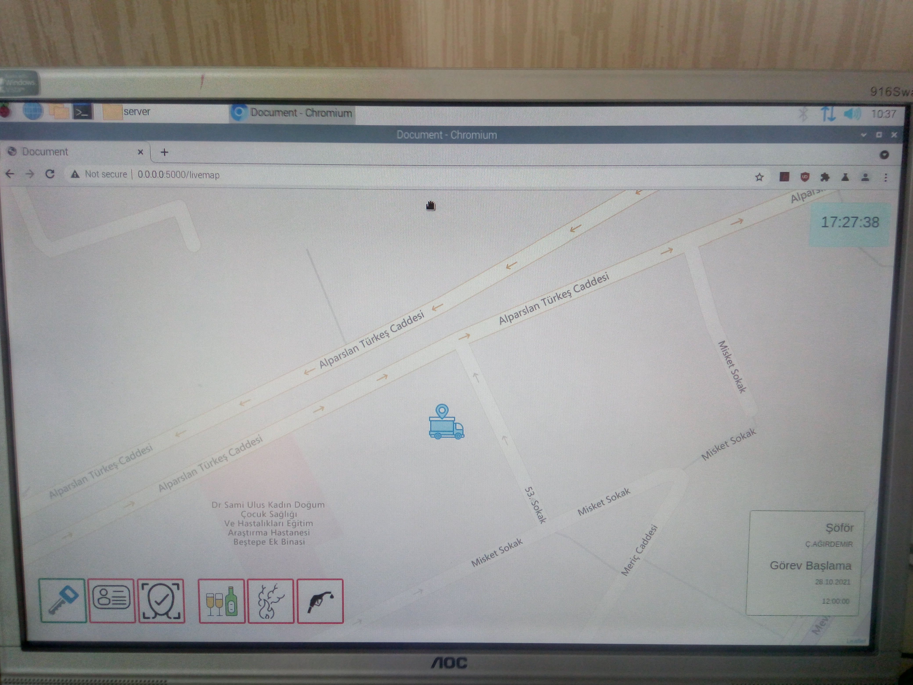

# Kamyon Takip Sistemi

  
 Donanım Genel Görünüm 

  
 RAM Yapısı 

  
 Proje Ekranı 

Python ile yazılmıştır.
Memory Map ile programlar arası ortak hafıza alanı bulunur.

Written in Python and used memory map (mmap) to communication between sensor reading and recorder to database programs.
UBlox GPS Module, Face Recognition, RFID Card Reader, Smoke and Alcohol Sensor Reading 

SQLite veritabanı kullanılmıştır. 

Sürücü kontak açtığında sistem çalışmaya başlar.
